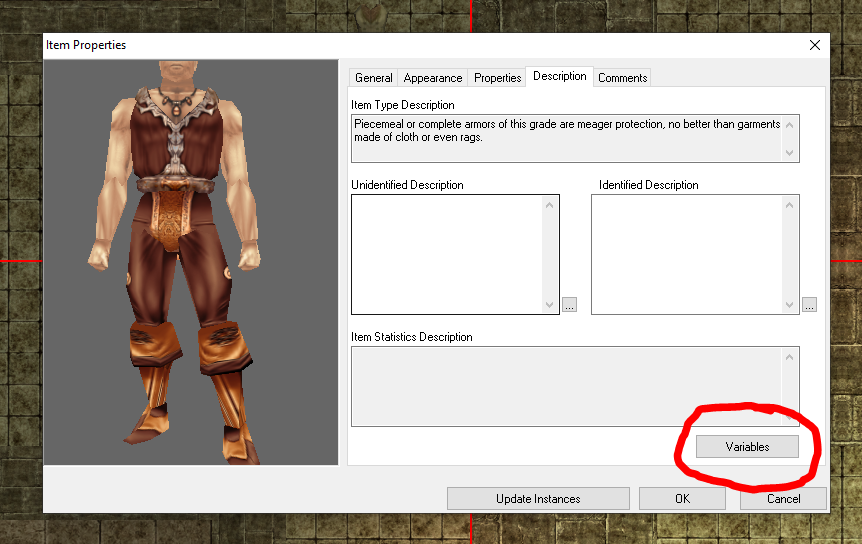

# NWSetItemProperties
Adds a wrapper for the OnPlayerEquipItem and OnPlayerUnEquipItem module event scripts that allows for the creation of set item bonuses with the toolkits item variables window.


# Getting Started
Download the `.nss` files in this repo and add them to your module.
`set_items_equ.nss` should be added as the `OnPlayerEquipItem` module script.
`set_items_ueq.nss` should be added as the `OnPlayerUnEquipItem` module script.

If you use a custom script for either of these events, you will need to update these files to point to your file in the `ExecuteScript` call:
```
#include "inc_loglevel"
#include "inc_setitm_utils"

void main()
{
    ExecuteScript(
        "x2_mod_def_equ"  // <---  Update your own file here if needed.
    );
```

# How to use
Now that you have the set scripts installed, you can use the item properties dialog to setup set item bonuses!
You can find the variables button for items under the description tab of the item properties window, in the bottom right.


To create your first set, add the following variables to all the items of your set.
|Name|Type|Value|
|----|----|----|
|SET_TAG_0|`string`|*[YourSetTag]*|

Now as a player equips these various items, the game will count up all of their currently equiped items that belong to that set and use that count to determin a set bonus level to apply to all of the items.

Lets create our first set bonus to apply to one of your set items!  Set bonuses are defined with the `SET_TAG_0_BONUS_#` prefix and must include the following to be valid
|Suffix|Type|Description|
|----|----|----|
|\_TYPE|`string`| Any of the `ITEM_PROPERTY_*` constants names.  You can find a list of these at https://nwnlexicon.com/index.php?title=Item_property|
|\_MIN_SET_ITEMS|`int`| The minimum number of items belonging to this set that must be equiped to apply this bonus.|

So lets add an omnious red glow that will only show up when the user has two items belonging to the set equiped. We start by adding our `ITEM_PROPERTY_LIGHT` type for the first bonus (0 indexed) and set this property to be applied when the user has put on two set items.  Now your items variables should look something like this (with replacements where appropriate).

|Name|Type|Value|
|----|----|----|
|SET_TAG_0|`string`|*[YourSetTag]*|
|SET_TAG_0_BONUS_0_TYPE|`string`|ITEM_PROPERTY_LIGHT|
|SET_TAG_0_BONUS_0_MIN_SET_ITEMS|`int`|2|

This instructs the script to apply the `ITEM_PROPERTY_LIGHT` effect to **this** piece of equipment when 2 or more set items are equiped.  However there are a couple more things we need.  The engine needs to know how bright the light needs to be and what color.  These are special props for this effect type.  Almost all effect types require a set of special props to define the properties of the effect.  These differ for each effect. Information on which effects require which special props can be found below. For `ITEM_PROPERTY_LIGHT` the two speical props are `_LIGHT` and `_COLOR`.  All special props are defeind as ints and will throw an error in your chat window if an int outside the property range is provided.  We want a dim light, witch is value 1, and a red light, witch is value 3.  Adding these, our final set of variables should be this.

|Name|Type|Value|
|----|----|----|
|SET_TAG_0|`string`|*[YourSetTag]*|
|SET_TAG_0_BONUS_0_TYPE|`string`|ITEM_PROPERTY_LIGHT|
|SET_TAG_0_BONUS_0_MIN_SET_ITEMS|`int`|2|
|SET_TAG_0_BONUS_0_LIGHT|`int`|1|
|SET_TAG_0_BONUS_0_COLOR|`int`|3|

And thats it!  Now when this item is equiped with another item with the same set tag, an extra property applying a dim red glow will be applied!  And when any item belonging to the set is unequiped, bringing the set bonus below the min set items for this prop, it will be removed!

One last point,  the numeric parts of the variable name template are 0 indexed and sequencial so to add the same item to another set, you would use the prefix `SET_TAG_1` or to add a new set bonus `_BONUS_1`.  Combinations of these can be used to setup multi set bonuses and to setup teird bonuses to be applied as a person aquires more and more set items!  Experiment and have fun (and report bugs here on github when you run into them)!

# Special Properties

The following information is auto generated from the code.  Until I can go through and flush out the various descriptions and such, you can find more info about the special props by going to https://nwnlexicon.com/index.php?title=Item_property and following the link to the various **IP Functions** for the ITEM_PROPERTY you are looking for.

#### ITEM_PROPERTY_ABILITY_BONUS
| Special Prop | Range | Description |
|----|----|----|
|_ABILITY_BONUS|**0 to 5**|[See IP_CONST_ABILITY_*](https://nwnlexicon.com/index.php?title=Ip_const_ability) for possible *values*|
|_VALUE|**1 to 12**| The ability score bonus to provide.|


#### ITEM_PROPERTY_AC_BONUS
| Special Prop | Range | Description |
|----|----|----|
|_VALUE|**1 to 20**| The AC Bonus value to provide.|


#### ITEM_PROPERTY_AC_BONUS_VS_ALIGNMENT_GROUP
| Special Prop | Range | Description |
|----|----|----|
|_AC_BONUS_VS_ALIGNMENT_GROUP|**0 to 5**|[See IP_CONST_ALIGNMENTGROUP_*](https://nwnlexicon.com/index.php?title=Ip_const_alignmentgroup) for possible *values*|
|_VALUE|**1 to 20**|The AC Bonus value to provide.|


#### ITEM_PROPERTY_AC_BONUS_VS_DAMAGE_TYPE
| Special Prop | Range | Description |
|----|----|----|
|_AC_BONUS_VS_DAMAGE_TYPE|**0 to 13**|[See IP_CONST_DAMAGETYPE_*](https://nwnlexicon.com/index.php?title=Ip_const_damagetype) for possible *values*|
|_VALUE|**1 to 20**|The AC Bonus value to provide.|


#### ITEM_PROPERTY_AC_BONUS_VS_RACIAL_GROUP
| Special Prop | Range | Description |
|----|----|----|
|_AC_BONUS_VS_RACIAL_GROUP|**0 to 25**|[See IP_CONST_RACIALTYPE_*](https://nwnlexicon.com/index.php?title=Ip_const_racialtype) for possible *values*|
|_VALUE|**1 to 20**|The AC Bonus value to provide.|


#### ITEM_PROPERTY_AC_BONUS_VS_SPECIFIC_ALIGNMENT
| Special Prop | Range | Description |
|----|----|----|
|_AC_BONUS_VS_SPECIFIC_ALIGNMENT|**0 to 8**|[See IP_CONST_ALIGNMENT_*](https://nwnlexicon.com/index.php?title=Ip_const_alignment) for possible *values*|
|_VALUE|**1 to 20**|The AC Bonus value to provide.|


#### ITEM_PROPERTY_ADDITIONAL
| Special Prop | Range | Description |
|----|----|----|
|_ADDITIONAL|**0 to 1**|[See IP_CONST_ADDITIONAL_*](https://nwnlexicon.com/index.php?title=Ip_const_additional) for possible *values*|


#### ITEM_PROPERTY_ARCANE_SPELL_FAILURE
| Special Prop | Range | Description |
|----|----|----|
|_ARCANE_SPELL_FAILURE|**0 to 19**|[See IP_CONST_ARCANE_SPELL_FAILURE_*](https://nwnlexicon.com/index.php?title=ItemPropertyArcaneSpellFailure) for possible *values* |


#### ITEM_PROPERTY_ATTACK_BONUS
| Special Prop | Range | Description |
|----|----|----|
|_ATTACK_BONUS|**1 to 20**|The attack bonus value to provide.|


#### ITEM_PROPERTY_ATTACK_BONUS_VS_ALIGNMENT_GROUP
| Special Prop | Range | Description |
|----|----|----|
|_ATTACK_BONUS_VS_ALIGNMENT_GROUP|**0 to 5**|[See IP_CONST_ALIGNMENTGROUP_*](https://nwnlexicon.com/index.php?title=Ip_const_alignmentgroup) for possible *values*|
|_VALUE|**1 to 20**|The attack bonus value to provide.|


#### ITEM_PROPERTY_ATTACK_BONUS_VS_RACIAL_GROUP
| Special Prop | Range | Description |
|----|----|----|
|_ATTACK_BONUS_VS_RACIAL_GROUP|**0 to 25**|[See IP_CONST_RACIALTYPE_*](https://nwnlexicon.com/index.php?title=Ip_const_racialtype) for possible *values*|
|_VALUE|**1 to 20**|The attack bonus value to provide.|


#### ITEM_PROPERTY_ATTACK_BONUS_VS_SPECIFIC_ALIGNMENT
| Special Prop | Range | Description |
|----|----|----|
|_ATTACK_BONUS_VS_SPECIFIC_ALIGNMENT|**0 to 8**|[See IP_CONST_ALIGNMENT_*](https://nwnlexicon.com/index.php?title=Ip_const_alignment) for possible *values*|
|_VALUE|**1 to 20**|The attack bonus value to provide.|


#### ITEM_PROPERTY_BASE_ITEM_WEIGHT_REDUCTION
| Special Prop | Range | Description |
|----|----|----|
|_BASE_ITEM_WEIGHT_REDUCTION|**1 to 5**|[See IP_CONST_REDUCEDWEIGHT_*](https://nwnlexicon.com/index.php?title=Ip_const_reducedweight) for possible *values*|


#### ITEM_PROPERTY_BONUS_FEAT
| Special Prop | Range | Description |
|----|----|----|
|_BONUS_FEAT|**0 to 62**|[See IP_CONST_FEAT_*](https://nwnlexicon.com/index.php?title=Ip_const_feat) for possible *values*|


#### ITEM_PROPERTY_BONUS_SPELL_SLOT_OF_LEVEL_N
| Special Prop | Range | Description |
|----|----|----|
|_CLASS|**0 to 10**|[See IP_CONST_CLASS_*](https://nwnlexicon.com/index.php?title=Ip_const_class) for possible *values*|
|_BONUS_SPELL_SLOT_OF_LEVEL_N|**0 to 9**|The level of the spell slot to provide.|


#### ITEM_PROPERTY_CAST_SPELL
| Special Prop | Range | Description |
|----|----|----|
|_CAST_SPELL|**0 to 410**|[See IP_CONST_CASTSPELL_*](https://nwnlexicon.com/index.php?title=Ip_const_castspell) for possible *values*|
|_USES|**1 to 13**|[See IP_CONST_CASTSPELL_NUMUSES_*](https://nwnlexicon.com/index.php?title=Ip_const_castspell_numuses) for possible *values*|


#### ITEM_PROPERTY_DAMAGE_BONUS
| Special Prop | Range | Description |
|----|----|----|
|_DAMAGE_TYPE|**0 to 13**|[See IP_CONST_DAMAGETYPE_*](https://nwnlexicon.com/index.php?title=Ip_const_damagetype) for possible *values*|
|_DAMAGE_BONUS|**1 to 20**|[See IP_CONST_DAMAGEBONUS_*](https://nwnlexicon.com/index.php?title=Ip_const_damagebonus) for possible *values*|


#### ITEM_PROPERTY_DAMAGE_BONUS_VS_ALIGNMENT_GROUP
| Special Prop | Range | Description |
|----|----|----|
|_DAMAGE_BONUS_VS_ALIGNMENT_GROUP|**0 to 5**|[See IP_CONST_ALIGNMENTGROUP_*](https://nwnlexicon.com/index.php?title=Ip_const_alignmentgroup) for possible *values*|
|_DAMAGE_TYPE|**0 to 13**|[See IP_CONST_DAMAGETYPE_*](https://nwnlexicon.com/index.php?title=Ip_const_damagetype) for possible *values*|
|_DAMAGE_BONUS|**1 to 20**|[See IP_CONST_DAMAGEBONUS_*](https://nwnlexicon.com/index.php?title=Ip_const_damagebonus) for possible *values*|

#### ITEM_PROPERTY_DAMAGE_BONUS_VS_RACIAL_GROUP
| Special Prop | Range | Description |
|----|----|----|
|_DAMAGE_BONUS_VS_RACIAL_GROUP|**0 to 25**|[See IP_CONST_RACIALTYPE_*](https://nwnlexicon.com/index.php?title=Ip_const_racialtype) for possible *values*|
|_DAMAGE_TYPE|**0 to 13**|[See IP_CONST_DAMAGETYPE_*](https://nwnlexicon.com/index.php?title=Ip_const_damagetype) for possible *values*|
|_DAMAGE_BONUS|**1 to 20**|[See IP_CONST_DAMAGEBONUS_*](https://nwnlexicon.com/index.php?title=Ip_const_damagebonus) for possible *values*|

#### ITEM_PROPERTY_DAMAGE_BONUS_VS_SPECIFIC_ALIGNMENT
| Special Prop | Range | Description |
|----|----|----|
|_DAMAGE_BONUS_VS_SPECIFIC_ALIGNMENT|**0 to 8**|[See IP_CONST_ALIGNMENT_*](https://nwnlexicon.com/index.php?title=Ip_const_alignment) for possible *values*|
|_DAMAGE_TYPE|**0 to 13**|[See IP_CONST_DAMAGETYPE_*](https://nwnlexicon.com/index.php?title=Ip_const_damagetype) for possible *values*|
|_DAMAGE_BONUS|**1 to 20**|[See IP_CONST_DAMAGEBONUS_*](https://nwnlexicon.com/index.php?title=Ip_const_damagebonus) for possible *values*|

#### ITEM_PROPERTY_DAMAGE_REDUCTION
| Special Prop | Range | Description |
|----|----|----|
|_DAMAGE_REDUCTION|**0 to 19**|[See IP_CONST_DAMAGEREDUCTION_*](https://nwnlexicon.com/index.php?title=Ip_const_damagereduction) for possible *values*|
|_DAMAGE_SOAK|**1 to 10**|[See IP_CONST_DAMAGESOAK_*](https://nwnlexicon.com/index.php?title=Ip_const_damagesoak) for possible *values*|


#### ITEM_PROPERTY_DAMAGE_RESISTANCE
| Special Prop | Range | Description |
|----|----|----|
|_DAMAGE_TYPE|**0 to 13**|[See IP_CONST_DAMAGETYPE_*](https://nwnlexicon.com/index.php?title=Ip_const_damagetype) for possible *values*|
|_DAMAGE_RESISTANCE|**1 to 10**|[See IP_CONST_DAMAGERESIST_**](https://nwnlexicon.com/index.php?title=Ip_const_damageresist) for possible *values*|


#### ITEM_PROPERTY_DAMAGE_VULNERABILITY
| Special Prop | Range | Description |
|----|----|----|
|_DAMAGE_TYPE|**0 to 13**|[See IP_CONST_DAMAGETYPE_*](https://nwnlexicon.com/index.php?title=Ip_const_damagetype) for possible *values*|
|_DAMAGE_VULNERABILITY|**1 to 7**|[See IP_CONST_DAMAGEVULNERABILITY_*](https://nwnlexicon.com/index.php?title=Ip_const_damagevulnerability) for possible *values*|


#### ITEM_PROPERTY_DARKVISION
| Special Prop | Range | Description |
|----|----|----|


#### ITEM_PROPERTY_DECREASED_ABILITY_SCORE
| Special Prop | Range | Description |
|----|----|----|
|_DECREASED_ABILITY_SCORE|**0 to 5**|[See IP_CONST_ABILITY_*](https://nwnlexicon.com/index.php?title=Ip_const_ability) for possible *values*|
|_MODIFIER|**1 to 50**|Amount to decrease by|


#### ITEM_PROPERTY_DECREASED_AC
| Special Prop | Range | Description |
|----|----|----|
|_MODIFIER|**0 to 4**|[See IP_CONST_ACMODIFIERTYPE_*](https://nwnlexicon.com/index.php?title=Ip_const_acmodifiertype) for possible *values*|
|_DECREASED_AC|**1 to 5**|Decrease AC by how much.|


#### ITEM_PROPERTY_DECREASED_ATTACK_MODIFIER
| Special Prop | Range | Description |
|----|----|----|
|_DECREASED_ATTACK_MODIFIER|**1 to 5**|Attack penalty|


#### ITEM_PROPERTY_DECREASED_DAMAGE
| Special Prop | Range | Description |
|----|----|----|
|_DECREASED_DAMAGE|**1 to 5**|Damage penalty|


#### ITEM_PROPERTY_DECREASED_ENHANCEMENT_MODIFIER
| Special Prop | Range | Description |
|----|----|----|
|_DECREASED_ENHANCEMENT_MODIFIER|**1 to 5**|Amount of penalty to apply to weapon|


#### ITEM_PROPERTY_DECREASED_SAVING_THROWS
| Special Prop | Range | Description |
|----|----|----|
|_SAVE_VS|**0 to 15**|[See IP_CONST_SAVEVS_*](https://nwnlexicon.com/index.php?title=Ip_const_savevs) for possible *values*|
|_DECREASED_SAVING_THROWS|**1 to 20**|Reduce by how much|


#### ITEM_PROPERTY_DECREASED_SAVING_THROWS_SPECIFIC
| Special Prop | Range | Description |
|----|----|----|
|_SAVE_VS|**0 to 15**|[See IP_CONST_SAVEBASETYPE_*](https://nwnlexicon.com/index.php?title=Ip_const_savebasetype) for possible *values*|
|_DECREASED_SAVING_THROWS_SPECIFIC|**1 to 20**|Reduce saving throw by this|


#### ITEM_PROPERTY_DECREASED_SKILL_MODIFIER
| Special Prop | Range | Description |
|----|----|----|
|_SKILL_MODIFIER|**0 to 255**|[See SKILL_*](https://nwnlexicon.com/index.php?title=Skill) for possible *values*|
|_DECREASED_SKILL_MODIFIER|**1 to 50**|Amount of ability to reduce skill|


#### ITEM_PROPERTY_ENHANCED_CONTAINER_REDUCED_WEIGHT
| Special Prop | Range | Description |
|----|----|----|
|_ENHANCED_CONTAINER_REDUCED_WEIGHT|**1 to 5**|[See IP_CONST_CONTAINERWEIGHTRED_*](https://nwnlexicon.com/index.php?title=Ip_const_containerweightred) for possible *values*|


#### ITEM_PROPERTY_ENHANCEMENT_BONUS
| Special Prop | Range | Description |
|----|----|----|
|_ENHANCEMENT_BONUS|**1 to 20**|How much to enhance weapon|


#### ITEM_PROPERTY_ENHANCEMENT_BONUS_VS_ALIGNMENT_GROUP
| Special Prop | Range | Description |
|----|----|----|
|_ENHANCEMENT_BONUS_VS_ALIGNMENT_GROUP|**0 to 5**|[See IP_CONST_ALIGNMENTGROUP_*](https://nwnlexicon.com/index.php?title=Ip_const_alignmentgroup) for possible *values*|
|_VALUE|**1 to 20**|How much to enhance weapon|


#### ITEM_PROPERTY_ENHANCEMENT_BONUS_VS_RACIAL_GROUP
| Special Prop | Range | Description |
|----|----|----|
|_ENHANCEMENT_BONUS_VS_RACIAL_GROUP|**0 to 25**|[See IP_CONST_RACIALTYPE_*](https://nwnlexicon.com/index.php?title=Ip_const_racialtype) for possible *values*|
|_VALUE|**1 to 20**|How much to enhance weapon|


#### ITEM_PROPERTY_ENHANCEMENT_BONUS_VS_SPECIFIC_ALIGNEMENT
| Special Prop | Range | Description |
|----|----|----|
|_ENHANCEMENT_BONUS_VS_SPECIFIC_ALIGNEMENT|**0 to 8**|[See IP_CONST_ALIGNMENT_*](https://nwnlexicon.com/index.php?title=Ip_const_alignment) for possible *values*|
|_VALUE|**1 to 20**|How much to enhance weapon|


#### ITEM_PROPERTY_EXTRA_MELEE_DAMAGE_TYPE
| Special Prop | Range | Description |
|----|----|----|
|_EXTRA_MELEE_DAMAGE_TYPE|**0 to 13**|[See IP_CONST_DAMAGETYPE_*](https://nwnlexicon.com/index.php?title=Ip_const_damagetype) for possible *values*|


#### ITEM_PROPERTY_EXTRA_RANGED_DAMAGE_TYPE
| Special Prop | Range | Description |
|----|----|----|
|_EXTRA_RANGED_DAMAGE_TYPE|**0 to 13**|[See IP_CONST_DAMAGETYPE_*](https://nwnlexicon.com/index.php?title=Ip_const_damagetype) for possible *values*|


#### ITEM_PROPERTY_FREEDOM_OF_MOVEMENT
| Special Prop | Range | Description |
|----|----|----|


#### ITEM_PROPERTY_HASTE
| Special Prop | Range | Description |
|----|----|----|


#### ITEM_PROPERTY_HEALERS_KIT
| Special Prop | Range | Description |
|----|----|----|
|_HEALERS_KIT|**1 to 12**||


#### ITEM_PROPERTY_HOLY_AVENGER
| Special Prop | Range | Description |
|----|----|----|


#### ITEM_PROPERTY_IMMUNITY_DAMAGE_TYPE
| Special Prop | Range | Description |
|----|----|----|
|_IMMUNITY_DAMAGE_TYPE|**0 to 13**|[See IP_CONST_DAMAGETYPE_*](https://nwnlexicon.com/index.php?title=Ip_const_damagetype) for possible *values*|
|_IMMUNE_BONUS|**1 to 7**|[See IP_CONST_DAMAGEIMMUNITY_*](https://nwnlexicon.com/index.php?title=Ip_const_damageimmunity) for possible *values*|


#### ITEM_PROPERTY_IMMUNITY_MISCELLANEOUS
| Special Prop | Range | Description |
|----|----|----|
|_IMMUNITY_MISCELLANEOUS|**0 to 9**|[See IP_CONST_IMMUNITYMISC_*](https://nwnlexicon.com/index.php?title=Ip_const_immunitymisc) for possible *values*|


#### ITEM_PROPERTY_IMMUNITY_SPECIFIC_SPELL
| Special Prop | Range | Description |
|----|----|----|
|_IMMUNITY_SPECIFIC_SPELL|**0 to 187**|[See IP_CONST_IMMUNITYSPELL_*](https://nwnlexicon.com/index.php?title=Ip_const_immunityspell) for possible *values*|


#### ITEM_PROPERTY_IMMUNITY_SPELL_SCHOOL
| Special Prop | Range | Description |
|----|----|----|
|_IMMUNITY_SPELL_SCHOOL|**0 to 7**|[See IP_CONST_SPELLSCHOOL_*](https://nwnlexicon.com/index.php?title=Ip_const_spellschool) for possible *values*|


#### ITEM_PROPERTY_IMMUNITY_SPELLS_BY_LEVEL
| Special Prop | Range | Description |
|----|----|----|
|_IMMUNITY_SPELLS_BY_LEVEL|**1 to 9**|Immune to this level and below|


#### ITEM_PROPERTY_IMPROVED_EVASION
| Special Prop | Range | Description |
|----|----|----|


#### ITEM_PROPERTY_KEEN
| Special Prop | Range | Description |
|----|----|----|


#### ITEM_PROPERTY_LIGHT
| Special Prop | Range | Description |
|----|----|----|
|_LIGHT|**1 to 4**|[See IP_CONST_LIGHTBRIGHTNESS_*](https://nwnlexicon.com/index.php?title=Ip_const_lightbrightness) for possible *values*|
|_COLOR|**0 to 6**|[See IP_CONST_LIGHTCOLOR_*](https://nwnlexicon.com/index.php?title=Ip_const_lightcolor) for possible *values*|


#### ITEM_PROPERTY_MASSIVE_CRITICALS
| Special Prop | Range | Description |
|----|----|----|
|_MASSIVE_CRITICALS|**1 to 20**|[See IP_CONST_DAMAGEBONUS_*](https://nwnlexicon.com/index.php?title=Ip_const_damagebonus) for possible *values*|


#### ITEM_PROPERTY_MATERIAL
| Special Prop | Range | Description |
|----|----|----|
|_MATERIAL|**0 to 77**|[See ItemPropertyMaterial](https://nwnlexicon.com/index.php?title=ItemPropertyMaterial#Known_Bugs:) for information on this value.|


#### ITEM_PROPERTY_MIGHTY
| Special Prop | Range | Description |
|----|----|----|
|_MIGHTY|**1 to 20**|Maximum allowed strength modifier|


#### ITEM_PROPERTY_MIND_BLANK
This property is missing it's constructor and thus is unavailabe via this toolset at this time.
| Special Prop | Range | Description |
|----|----|----|


#### ITEM_PROPERTY_MONSTER_DAMAGE
| Special Prop | Range | Description |
|----|----|----|
|_MONSTER_DAMAGE|**1 to 57**|[See IP_CONST_MONSTERDAMAGE_*](https://nwnlexicon.com/index.php?title=Ip_const_monsterdamage) for possible *values*|


#### ITEM_PROPERTY_NO_DAMAGE
| Special Prop | Range | Description |
|----|----|----|


#### ITEM_PROPERTY_ON_HIT_PROPERTIES
| Special Prop | Range | Description |
|----|----|----|
|_ON_HIT_PROPERTIES|**0 to 25**|[See IP_CONST_ONHIT_*](https://nwnlexicon.com/index.php?title=Ip_const_onhit) for possible *values*|
|_SAVE_DC|**0 to 6**|[See IP_CONST_ONHIT_SAVEDC_*](https://nwnlexicon.com/index.php?title=Ip_const_onhit_savedc) for possible *values*|
|_SPECIAL|**0 to 255**|[See ItemPropertyOnHitProps](https://nwnlexicon.com/index.php?title=ItemPropertyOnHitProps#Description) for details on this property.|

#### ITEM_PROPERTY_ON_MONSTER_HIT
This property has know bugs in it's constructor.  [See ItemPropertyOnMonsterHitProperties](https://nwnlexicon.com/index.php?title=ItemPropertyOnMonsterHitProperties) for more information.
| Special Prop | Range | Description |
|----|----|----|
|_ON_MONSTER_HIT|**0 to 9**|[See IP_CONST_ONMONSTERHIT_*](https://nwnlexicon.com/index.php?title=Ip_const_onmonsterhit) for possible *values*|
|_SPECIAL|**0 to 255**|[See ItemPropertyOnMonsterHitProperties](https://nwnlexicon.com/index.php?title=ItemPropertyOnMonsterHitProperties) for more information.|


#### ITEM_PROPERTY_ONHITCASTSPELL
| Special Prop | Range | Description |
|----|----|----|
|_ONHITCASTSPELL|**0 to 140**|[See IP_CONST_ONHIT_CASTSPELL_*](https://nwnlexicon.com/index.php?title=Ip_const_onhit_castspell) for possible *values*|
|_CAST_LEVEL|**0 to ??**|Level at which to cast the spell|


#### ITEM_PROPERTY_POISON
This property lacks a constructor and thus cannot be used with this tool at this time.
| Special Prop | Range | Description |
|----|----|----|


#### ITEM_PROPERTY_QUALITY
| Special Prop | Range | Description |
|----|----|----|
|_QUALITY|**0 to 15**|[See IP_CONST_QUALITY_*](https://nwnlexicon.com/index.php?title=Ip_const_quality) for possible *values*|


#### ITEM_PROPERTY_REGENERATION
| Special Prop | Range | Description |
|----|----|----|
|_REGENERATION|**1 to 20**|Regenerate by how much|


#### ITEM_PROPERTY_REGENERATION_VAMPIRIC
| Special Prop | Range | Description |
|----|----|----|
|_REGENERATION_VAMPIRIC|**1 to 20**|Regenerate by how much|


#### ITEM_PROPERTY_SAVING_THROW_BONUS
| Special Prop | Range | Description |
|----|----|----|
|_SAVE_VS|**0 to 15**|[See IP_CONST_SAVEVS_*](https://nwnlexicon.com/index.php?title=Ip_const_savevs) for possible *values*|
|_SAVING_THROW_BONUS|**1 to 20**|Saving throw bonus|


#### ITEM_PROPERTY_SAVING_THROW_BONUS_SPECIFIC
| Special Prop | Range | Description |
|----|----|----|
|_SAVING_THROW_BONUS_SPECIFIC|**1 to 3**|[See IP_CONST_SAVEBASETYPE_*](https://nwnlexicon.com/index.php?title=Ip_const_savebasetype) for possible *values*|
|_SAVING_THROW_BONUS|**1 to 20**|Bonus to add|


#### ITEM_PROPERTY_SKILL_BONUS
| Special Prop | Range | Description |
|----|----|----|
|_SKILL_BONUS|**0 to 255**|[See SKILL_*](https://nwnlexicon.com/index.php?title=Skill) for possible *values*|
|_VALUE|**1 to 50**|Bonus amount|


#### ITEM_PROPERTY_SPECIAL_WALK
| Special Prop | Range | Description |
|----|----|----|
|_SPECIAL_WALK|**0 to 0**|Walktype|


#### ITEM_PROPERTY_SPELL_RESISTANCE
| Special Prop | Range | Description |
|----|----|----|
|_SPELL_RESISTANCE|**0 to 11**|[See IP_CONST_SPELLRESISTANCEBONUS_*](https://nwnlexicon.com/index.php?title=Ip_const_spellresistancebonus) for possible *values*|


#### ITEM_PROPERTY_THIEVES_TOOLS
| Special Prop | Range | Description |
|----|----|----|
|_THIEVES_TOOLS|**1 to 12**|Pick lock bonus to the tools.|


#### ITEM_PROPERTY_TRAP
| Special Prop | Range | Description |
|----|----|----|
|_VALUE|**0 to 3**|[See IP_CONST_TRAPSTRENGTH_*](https://nwnlexicon.com/index.php?title=Ip_const_trapstrength) for possible *values*|
|_TRAP|**1 to 11**|[See IP_CONST_TRAPTYPE_*](https://nwnlexicon.com/index.php?title=Ip_const_traptype) for possible *values*|


#### ITEM_PROPERTY_TRUE_SEEING
| Special Prop | Range | Description |
|----|----|----|


#### ITEM_PROPERTY_TURN_RESISTANCE
| Special Prop | Range | Description |
|----|----|----|
|_TURN_RESISTANCE|**1 to 50**|Turn resistance bonus to add|


#### ITEM_PROPERTY_UNLIMITED_AMMUNITION
| Special Prop | Range | Description |
|----|----|----|
|_UNLIMITED_AMMUNITION|**1 to 15**|[See IP_CONST_UNLIMITEDAMMO_*](https://nwnlexicon.com/index.php?title=Ip_const_unlimitedammo) for possible *values*|


#### ITEM_PROPERTY_USE_LIMITATION_ALIGNMENT_GROUP
| Special Prop | Range | Description |
|----|----|----|
|_USE_LIMITATION_ALIGNMENT_GROUP|**0 to 5**|[See IP_CONST_ALIGNMENTGROUP_*](https://nwnlexicon.com/index.php?title=Ip_const_alignmentgroup) for possible *values*|


#### ITEM_PROPERTY_USE_LIMITATION_CLASS
| Special Prop | Range | Description |
|----|----|----|
|_USE_LIMITATION_CLASS|**0 to 10**|[See IP_CONST_CLASS_*](https://nwnlexicon.com/index.php?title=Ip_const_class) for possible *values*|


#### ITEM_PROPERTY_USE_LIMITATION_RACIAL_TYPE
| Special Prop | Range | Description |
|----|----|----|
|_USE_LIMITATION_RACIAL_TYPE|**0 to 25**|[See IP_CONST_RACIALTYPE_*](https://nwnlexicon.com/index.php?title=Ip_const_racialtype) for possible *values*|


#### ITEM_PROPERTY_USE_LIMITATION_SPECIFIC_ALIGNMENT
| Special Prop | Range | Description |
|----|----|----|
|_USE_LIMITATION_SPECIFIC_ALIGNMENT|**0 to 8**|[See IP_CONST_ALIGNMENT_*](https://nwnlexicon.com/index.php?title=Ip_const_alignment) for possible *values*|


#### ITEM_PROPERTY_USE_LIMITATION_TILESET
| Special Prop | Range | Description |
|----|----|----|


#### ITEM_PROPERTY_VISUALEFFECT
| Special Prop | Range | Description |
|----|----|----|
|_VISUALEFFECT|**0 to 6**|[See ITEM_VISUAL_*](https://nwnlexicon.com/index.php?title=Item_visual) for possible *values*|


#### ITEM_PROPERTY_WEIGHT_INCREASE
| Special Prop | Range | Description |
|----|----|----|
|_WEIGHT_INCREASE|**0 to 5**|[See IP_CONST_WEIGHTINCREASE_*](https://nwnlexicon.com/index.php?title=Ip_const_weightincrease) for possible *values*|
