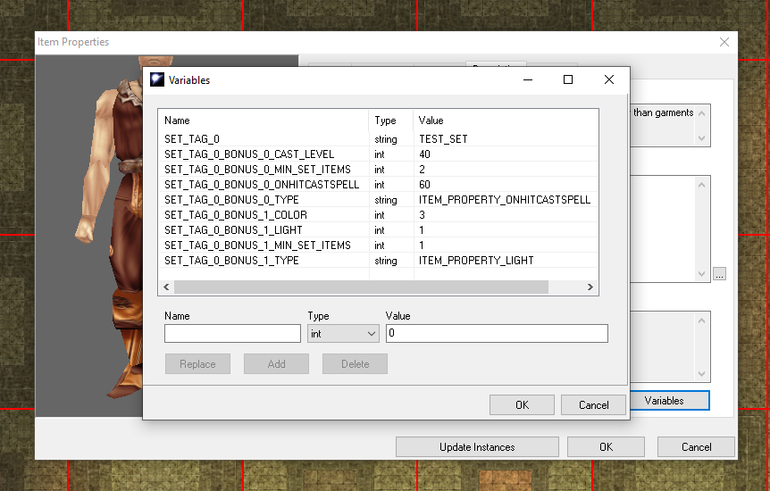

# NWSetItemProperties
Adds a wrapper for the OnPlayerEquipItem and OnPlayerUnEquipItem module event scripts that allows for the creation of set item bonuses with the toolkits item variables window.



# Getting Started
Download the `.nss` files in this repo and add them to your module.
`set_items_equ.nss` should be added as the `OnPlayerEquipItem` module script.
'set_items_ueq.nss` should be added as the `OnPlayerUnEquipItem` module script.

If you use a custom script for either of these events, you will need to update these files to point to your file in the `ExecuteScript` call:
```
#include "inc_loglevel"
#include "inc_setitm_utils"

void main()
{
    ExecuteScript(
        "x2_mod_def_equ"  // <---  Update your own file here if needed.
    );
```

# How to use
Now that you have the set scripts installed, you can use the item properties dialog to setup set item bonuses!
You can find the variables button for items under the description tab of the item properties window, in the bottom right.


To create your first set, add the following variables to all the items of your set.
|Name|Type|Value|
|----|----|----|
|SET_TAG_0|`string`|*[YourSetTag]*|

Now as a player equips these various items, the game will count up all of their currently equiped items that belong to that set and use that count to determin a set bonus level to apply to all of the items.

Lets create our first set bonus to apply to one of your set items!  Set bonuses are defined with the `SET_TAG_0_BONUS_#` prefix and must include the following to be valid
|Suffix|Type|Description|
|----|----|----|
|\_TYPE|`string`| Any of the `ITEM_PROPERTY_*` constants names.  You can find a list of these at https://nwnlexicon.com/index.php?title=Item_property|
|\_MIN_SET_ITEMS|`int`| The minimum number of items belonging to this set that must be equiped to apply this bonus.|

So lets add an omnious red glow that will only show up when the user has two items belonging to the set equiped. We start by adding our `ITEM_PROPERTY_LIGHT` type for the first bonus (0 indexed) and set this property to be applied when the user has put on two set items.  Now your items variables should look something like this (with replacements where appropriate).

|Name|Type|Value|
|----|----|----|
|SET_TAG_0|`string`|*[YourSetTag]*|
|SET_TAG_0_BONUS_0_TYPE|`string`|ITEM_PROPERTY_LIGHT|
|SET_TAG_0_BONUS_0_MIN_SET_ITEMS|`int`|2|

This instructs the script to apply the `ITEM_PROPERTY_LIGHT` effect to **this** piece of equipment when 2 or more set items are equiped.  However there are a couple more things we need.  The engine needs to know how bright the light needs to be and what color.  These are special props for this effect type.  Almost all effect types require a set of special props to define the properties of the effect.  These differ for each effect and discripts on how to supply these values can be found below. For `ITEM_PROPERTY_LIGHT` the two speical props are `_LIGHT` and `_COLOR`.  All special props are defeind as ints and will throw an error in your chat window if an int outside the property range is provided.  We want a dim light, witch is value 1, and a red light, witch is value 3.  Adding these our final set of variables should be this.

|Name|Type|Value|
|----|----|----|
|SET_TAG_0|`string`|*[YourSetTag]*|
|SET_TAG_0_BONUS_0_TYPE|`string`|ITEM_PROPERTY_LIGHT|
|SET_TAG_0_BONUS_0_MIN_SET_ITEMS|`int`|2|
|SET_TAG_0_BONUS_0_LIGHT|`int`|1|
|SET_TAG_0_BONUS_0_COLOR|`int`|3|

And thats it!  Now when this item is equiped with another item with the same set tag, an extra property applying a dim red glow will be applied!  And when any item belonging to the set is unequiped brining the set bonus below the min set items for this prop, it will be removed!

One last point,  the numeric parts of the variable name template are 0 indexed and sequencial so to add the same item to another set, you would use the prefix `SET_TAG_1` or to add a new set bonus `_BONUS_1`.  Combinations of these can be used to setup multi set bonuses and to setup teird bonuses to be applied as a person aquires more and more set items!  Experiment and have fun (and report bugs here on github when you run into them)!

# Special Properties

|ITEM_PROPERTY_\*|Prop Suffix|Description|
|----|----|----|
|ITEM_PROPERTY_ABILITY_BONUS|\_ABILITY_BONUS|See (IP_CONST_ABILITY_\*)[https://nwnlexicon.com/index.php?title=Ip_const_ability]|
||\_VALUE| Bonus to add 1 - 12 |
|ITEM_PROPERTY_AC_BONUS| | |
|ITEM_PROPERTY_AC_BONUS_VS_ALIGNMENT_GROUP| | |
|ITEM_PROPERTY_ABILITY_BONUS| | |
|ITEM_PROPERTY_AC_BONUS_VS_RACIAL_GROUP| | |
|ITEM_PROPERTY_AC_BONUS_VS_SPECIFIC_ALIGNMENT| | |
|ITEM_PROPERTY_ADDITIONAL| | |
|ITEM_PROPERTY_ARCANE_SPELL_FAILURE| | |
|ITEM_PROPERTY_ATTACK_BONUS| | |
|ITEM_PROPERTY_ATTACK_BONUS_VS_ALIGNMENT_GROUP| | |
|ITEM_PROPERTY_ATTACK_BONUS_VS_RACIAL_GROUP| | |
|ITEM_PROPERTY_ATTACK_BONUS_VS_SPECIFIC_ALIGNMENT| | |
|ITEM_PROPERTY_BASE_ITEM_WEIGHT_REDUCTION| | |
|ITEM_PROPERTY_BONUS_FEAT| | |
|ITEM_PROPERTY_BONUS_SPELL_SLOT_OF_LEVEL_N| | |
|ITEM_PROPERTY_CAST_SPELL| | |
|ITEM_PROPERTY_DAMAGE_BONUS| | |
|ITEM_PROPERTY_DAMAGE_BONUS_VS_ALIGNMENT_GROUP| | |
|ITEM_PROPERTY_DAMAGE_BONUS_VS_RACIAL_GROUP| | |
|ITEM_PROPERTY_DAMAGE_BONUS_VS_SPECIFIC_ALIGNMENT| | |
|ITEM_PROPERTY_DAMAGE_REDUCTION| | |
|ITEM_PROPERTY_DAMAGE_RESISTANCE| | |
|ITEM_PROPERTY_DAMAGE_VULNERABILITY| | |
|ITEM_PROPERTY_DARKVISION| | |
|ITEM_PROPERTY_DECREASED_ABILITY_SCORE| | |
|ITEM_PROPERTY_DECREASED_AC| | |
|ITEM_PROPERTY_DECREASED_ATTACK_MODIFIER| | |
|ITEM_PROPERTY_DECREASED_DAMAGE| | |
|ITEM_PROPERTY_DECREASED_ENHANCEMENT_MODIFIER| | |
|ITEM_PROPERTY_DECREASED_SAVING_THROWS| | |
|ITEM_PROPERTY_DECREASED_SAVING_THROWS_SPECIFIC| | |
|ITEM_PROPERTY_DECREASED_SKILL_MODIFIER| | |
|ITEM_PROPERTY_ENHANCED_CONTAINER_REDUCED_WEIGHT| | |
|ITEM_PROPERTY_ENHANCEMENT_BONUS| | |
|ITEM_PROPERTY_ENHANCEMENT_BONUS_VS_ALIGNMENT_GROUP| | |
|ITEM_PROPERTY_ENHANCEMENT_BONUS_VS_RACIAL_GROUP| | |
|ITEM_PROPERTY_ENHANCEMENT_BONUS_VS_SPECIFIC_ALIGNEMENT| | |
|ITEM_PROPERTY_EXTRA_MELEE_DAMAGE_TYPE| | |
|ITEM_PROPERTY_EXTRA_RANGED_DAMAGE_TYPE| | |
|ITEM_PROPERTY_FREEDOM_OF_MOVEMENT| | |
|ITEM_PROPERTY_HASTE| | |
|ITEM_PROPERTY_HEALERS_KIT| | |
|ITEM_PROPERTY_HOLY_AVENGER| | |
|ITEM_PROPERTY_IMMUNITY_DAMAGE_TYPE| | |
|ITEM_PROPERTY_IMMUNITY_MISCELLANEOUS| | |
|ITEM_PROPERTY_IMMUNITY_SPECIFIC_SPELL| | |
|ITEM_PROPERTY_IMMUNITY_SPELL_SCHOOL| | |
|ITEM_PROPERTY_IMMUNITY_SPELLS_BY_LEVEL| | |
|ITEM_PROPERTY_IMPROVED_EVASION| | |
|ITEM_PROPERTY_KEEN| | |
|ITEM_PROPERTY_LIGHT| | |
|ITEM_PROPERTY_MASSIVE_CRITICALS| | |
|ITEM_PROPERTY_MATERIAL| | |
|ITEM_PROPERTY_MIGHTY| | |
|ITEM_PROPERTY_MIND_BLANK| | |
|ITEM_PROPERTY_MONSTER_DAMAGE| | |
|ITEM_PROPERTY_NO_DAMAGE| | |
|ITEM_PROPERTY_ON_HIT_PROPERTIES| | |
|ITEM_PROPERTY_ON_MONSTER_HIT| | |
|ITEM_PROPERTY_ONHITCASTSPELL| | |
|ITEM_PROPERTY_POISON| | |
|ITEM_PROPERTY_QUALITY| | |
|ITEM_PROPERTY_REGENERATION| | |
|ITEM_PROPERTY_REGENERATION_VAMPIRIC| | |
|ITEM_PROPERTY_SAVING_THROW_BONUS| | |
|ITEM_PROPERTY_SAVING_THROW_BONUS_SPECIFIC| | |
|ITEM_PROPERTY_SKILL_BONUS| | |
|ITEM_PROPERTY_SPECIAL_WALK| | |
|ITEM_PROPERTY_SPELL_RESISTANCE| | |
|ITEM_PROPERTY_THIEVES_TOOLS| | |
|ITEM_PROPERTY_TRAP| | |
|ITEM_PROPERTY_TRUE_SEEING| | |
|ITEM_PROPERTY_TURN_RESISTANCE| | |
|ITEM_PROPERTY_UNLIMITED_AMMUNITION| | |
|ITEM_PROPERTY_USE_LIMITATION_ALIGNMENT_GROUP| | |
|ITEM_PROPERTY_USE_LIMITATION_CLASS| | |
|ITEM_PROPERTY_USE_LIMITATION_RACIAL_TYPE| | |
|ITEM_PROPERTY_USE_LIMITATION_SPECIFIC_ALIGNMENT| | |
|ITEM_PROPERTY_USE_LIMITATION_TILESET| | |
|ITEM_PROPERTY_VISUALEFFECT| | |
|ITEM_PROPERTY_WEIGHT_INCREASE| | |
